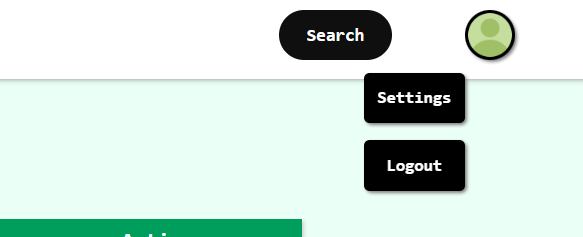
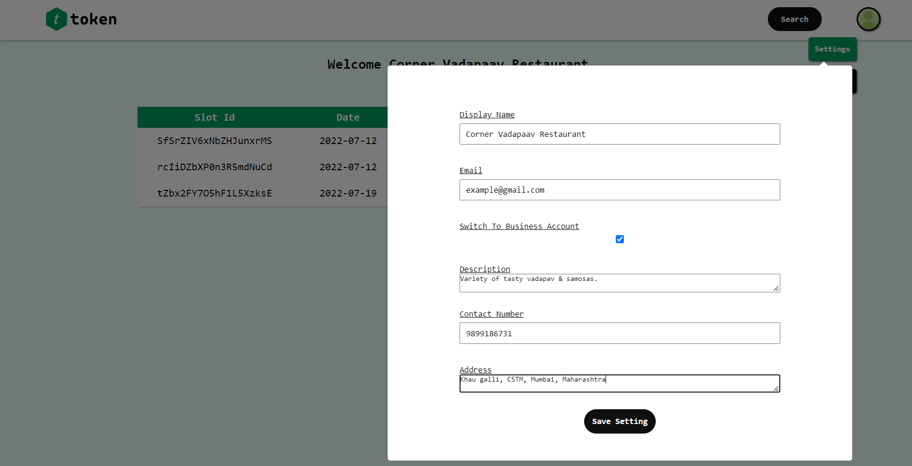
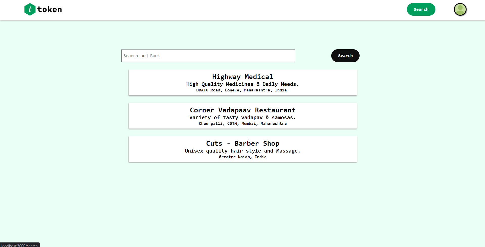

# Token - A Universal Booking App for every business

Token is for slot bookings and get tokens anywhere and anytime. It can be used by any businesses or intuitions, whoever wants to implement a booking system, whether they are small or well established, there customers can easily do bookings without visiting the place.
	
Token contains feature for businesses or intuitions to register themselves. People can watch available time slots and book them. 

<br/>

## Tech Stack

- ### Frontend : React, CSS
- ### Backend : ExpressJS, NodeJS
- ### Cloud Service : Firebase

<br/>


## Screenshots

- ### Login Page


<br/>

- ### Signup Page


<br/>

- ### Customer Dashboard


<br/>

- ### Business Dashboard


<br/>

- ### Add New Slots


<br/>

- ### Profile Menu


<br/>

- ### Booking Reciept


<br/>

- ### Profile Settings


<br/>

- ### Search


<br/>

- ### Booking Terminal


<br/>

<br/>

## Architecutral Diagrams

- ### Use Case Diagrams


<br/>

- ### Dataflow Diagrams


<br/>

## Steps to run project in development mode
- setup firebase console and add firebase service key to
```src/api/firebase-service.js```.<br>
[Follow these steps to setup firebase console and download the key](https://firebase.google.com/docs/web/setup)

- setup firebase service account and add firebase admin key to
```src/service-account-file.json```.<br>
[Follow these steps to setup firebase service account and download the key](https://cloud.google.com/docs/authentication/getting-started)

- install dependecies by running the following command in client and server folders.

```bash
npm install
```

- run server by running the following command in server folder.

```bash
npm run dev
```

- run client by running the following command in client folder.

```bash
npm run start
```

- client will run on port 3000 and sever will run on port 5000.

## API routes

- slots
    - create slot (post) - ``` /api/v1/slots ```
    - read slots (post) - ``` /api/v1/get-slots ```
    - update slot (put) - ``` /api/v1/put-slot ```
    - delete slot (delete) - ``` /api/v1/delete-slot ```

</br>

- users 
    - create user (post) - ``` /api/v1/users ```
    - update user role (put) - ``` /api/v1/users ```
    - read user role (post) - ``` /api/v1/get-role ```

</br>

- businesses 
    - read businesses (get) - ``` /get-businesses ```
    - read businesses by id (post) - ``` /get-businesses-by-id ```

## Client URLs

- login - ``` / ```
- signup - ``` /signup ```
- dashboard - ``` /dashboard ```
- bookslots - ``` /u/[user_id] ```
- search - ``` /search ```